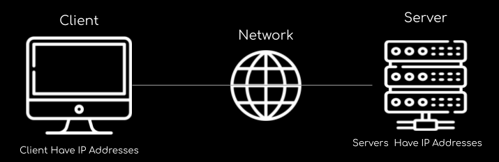
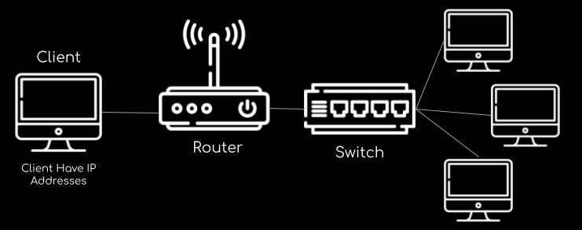

## How Wesite Works

- The server is Hosted somewhere
- We as a client want to get access to that server to visualise a website. As a clent we will use a network. A network between ourselves and server.
- Client will find the network and use to route the packets, the data into server. Then server will reply to us and we will get a response and we can view the website.
- To clients to find server and server to find client we need to have IP Addresses.
- so a clients have IP addreses and servers also have IP addresses.
- The idea of IP address is that you can send a request to wherever you want and server can know how to find you back.

## What is server Composed of ?

- Compute : CPU
- Memory : RAM
- Storage : Data
- Databse : Store Data In structured Way
- Networks : Routers, Switch, DNS Servers

## Some Terminology

- Network : Cable . routers and servers connected with each other.
- Router : A networking device that forwards data packets between computer networks. They know where to send your packets on internet.

- Switch : Switch Takes a packet and send it to correct server / client on Your network.

## Problems With traditional IT

- Pay the rant for the data center
- Pay for 24 x 7 power supply, cooling and maintanance
- Adding and replacing hardware takes time
- scaling is limited
- Hire 24 x 7 team to monitor
- How to Deal wih Disaters (Flood, Shutdown, Earthquack, ..)

With the help of cloud we can externalize all of this.

# What is Cloud Computing ?

Cloud Computing is **On-demand** Delivery of compute power, database storage, applications, and other IT Resources.

<kbd>On-demand : You get it when you need it</kbd>

- pay-as-you-go-pricing - when you are using it then you have to pay else not to worry.
- We can provision exactly the right type and size of computing resources as we need.
-
