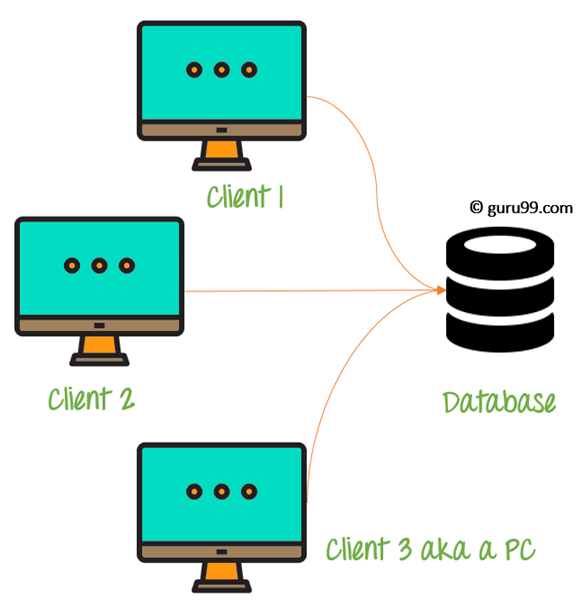

# Generic DBMS Interview Questions

## 1. What are the difference between DBMS and RDBMS ?

- DBMS Provides an organized way to managing, retrieving and storing from a collection of logically related Information.

- RDBMS provides the same as DBMS but it provides with relational Integrity.
  - in RDBMS complete data is related to each other and mostly stored in the form of table.
  - RDBMS is a Kind or type of DBMS

## 2. Explain the terms database and DBMS. Also, mention the different types of DBMS.

- **Database**: Consider a database as a big container where all your data are stored in a logical manner.

- **DBMS** : DBMS is a software application which interact with database, applications, and used to capture and analyses the required data.The data stored in database can be retrieved, deleted and modified based on the client requirements.

- Types of DBMS
  1. Relational
     - in this type of DBMS data is stored in the form of table and are related to each other
  2. Hierarchical
     - In this type of DBMS data is stored in the form of tree data structure.
     - Nodes represent the records and branches represents the feeds
  3. Network
     - This type of DBMS can in Many to Many relation and multiple nodes can be used to represent the data.
  4. Object-Oriented
     - This uses small software called as object to store pieces of data and methods such that we can perform some operations on them.

## 3. Advantages of DBMS 🔥

- Data Independence : Multiple user an fetch and use the data from the same database.
- Integrity Constraints : These constrains allows the data to be stored in refined manner
- Redundancy Control
- Provide Backup and Recovery facility

## 4. Mention the different languages present in DBMS.

1. **DDL - Data Definition Language**

   - Consists of the commands that can be used to define the database schema
   - create
   - DROP
   - ALTER
   - TRUNCATE

2. **DML - Data Manipulation Language**

   - Includes commands which deal with the manipulation of data present in database.
   - INSERT
   - UPDATE
   - DELETE

3. **DCL - Data Control Language**

   - Consists of command which deals with the rights, permissions and other controls of database system.
   - GRANT
   - REVOKE

4. **TCL - Transaction Control Language**

   - Includes the command which mainly deal with the transaction of database.
   - COMMIT
   - ROLL-BACK
   - SAVE-POINT

## 5. What do ypu understand by query optimization ?

- **Query Optimization** is a phase which identifies a plan for evaluation query that has the least estimated cost.

- Query optimization comes into picture when there are a lot of algorithms and method to solve the same problem.

- The advantages of Query optimizations
  - The output is provides faster
  - A larger number of queries can be executed in less time
  - Reduces time and space complexity

## 6. Do we consider NULL values the same as that blank space or Zero ?

- A NULL value is not at all similar to zero or blank space.
- NULL value represents a value which is not available.

## 7. What do you understand by aggregation and atomicity ?

1. **Aggregation** : It is a feature of entity relationship model set which allows a relationship set to participate in another relationship set.

2. **Atomicity** : This property states that a database modification must either follow all the rules or nothing at all. So if part of transaction fails then whole transaction fails.

## 8. What are the different level of abstraction in DBMS ?

- Physical Level
  - Lowest level of abstraction
  - Describes how the data is stored
- Logical Level
  - this abstraction comes after physical level
  - what data is stored and what is the relationship between them
- View Level
  - highest level of abstraction
  - it describes only a part of the database.

## 9. What is a entity-relationship Model (E-R Model) ?

It is a diagrammatic approach to database design, where we represent real-world objects as entities and mention relationships between them.

- E-R Model helps the team to understand the schema easily

## 10. What do you understand by the term Entity, Entity Types and Entity set in DBMS ?

1. **Entity** : Entity is a real-world object having attributes, which are nothing but characteristics of particular object.

   - A Student can be an entity and name, roll etc are there attributes

2. **Entity Type** : Entity type is nothing but the collection of entities, having the same attributes. Generally an entity type refers to one of more related tables in a particular database.'

3. **Entity Set** : An entity set is the collection of all the entities of a particular entity type in a database.
   - A set of employee, A set of company can come under entity set.

## 11. What are relationship and mention the different types of relationship in DBMS ?

A relationship in DBMS is a scenario where two entities are related to each other in such scenario the table consisting of foreign key references to the primary key of other table.

Type of relationship

1. One to One Relationship
   - single row in table A is related to single row in table B
2. One to many Relationship
   - Single row in table A is related to many rows in table B
3. Many to one Relationship
   - Many rows in table A is related to one row in table B
4. Self referencing relationship
   - When a row in table a is related to another row in same table

## 12. What is concurrency control ?

This is a process of managing simultaneous operations in a database so that database integrity is not compromised.

Approach to concurrency control:

1. Optimistic Approach
   - Involves versioning
2. Pessimistic Approach
   - Involves locking

## 13. What are ACID properties in DBMS ?

1. **Atomicity** : Atomicity refers to those transaction which are either completely successful or failed.

2. **Consistency** : Consistency ensures that data must meet all the validation rule.

3. **Isolation** : The main goal of isolation is concurrency control.

4. **Durability** : Durability means that if transaction has been committed, it will occur whatever may be the scenario.

## 14. What is normalization and What are the different type of normalization ?

Normalization is the process of organizing data in a database. This includes creating tables and establishing relationships between those tables according to rules designed both to protect the data and to make the database more flexible by eliminating redundancy and inconsistent dependency.

Types of Normalization

1. 1NF
2. 2NF
3. 3NF
4. BCNF

**1st Normal Form(1NF)**

- Each table cell should have single value. So basically all the records must be unique.

- This table is not in 1NF because subject has multiple value in it

  | Student | stream | subject  |
  | ------- | ------ | -------- |
  | Avinash | IT     | DSA, WEB |
  | Sam     | IT     | TOC,DBMS |

- To convert the above table into 1NF we need to make

  | Student | stream | subject |
  | ------- | ------ | ------- |
  | Avinash | IT     | DSA     |
  | Avinash | IT     | WEB     |
  | Sam     | IT     | TOC     |
  | Sam     | IT     | DBMS    |

**2nd Normal Form(2NF)**

- Database should be in 1NF and have **single column as primary key**

- After first normal from we have a lot of redundant row in table so to remove the redundancy divide the table into 2 table

- student table
  | Student | stream |
  | ------- | ------ |
  | Avinash | IT |
  | Sam | IT |

- Course Table
  | course | student |
  | ------ | ------- |
  | DSA | AVINASH |
  | WEB | AVINASH |
  | TOC | SAM |
  | DBMS | SAM |

**3rd Normal Form**

- The database should be in 2NF and must not have any transitive functional dependencies.

- After second normal form our Course table has a lot of data redundancy to remove that redundancy we have to normalize it to 3NF

**Boyse codd normal form(BCNF)**

- 3NF and all tables in the database should be only one primary key.

## 15. what are the different types of keys in DBMS ?

KEYS in DBMS is an attribute or set of attributes which helps you to identify a row(tuple) in a relation(table). They allow you to find the relation between two tables.

There are mainly 6 key in database

1. Super Key

   - A superkey is a group of single or multiple keys which identifies rows in a table.

2. Primary Key

   - PRIMARY KEY in DBMS is a column or group of columns in a table that uniquely identify every row in that table. The Primary Key can’t be a duplicate meaning the same value can’t appear more than once in the table. A table cannot have more than one primary key.

   - Rules for defining Primary key:
     - Two rows can’t have the same primary key value
     - It must for every row to have a primary key value.
     - The primary key field cannot be null.
     - The value in a primary key column can never be modified or updated if any foreign key refers to that primary key.

3. Candidate Key

   - CANDIDATE KEY in SQL is a set of attributes that uniquely identify tuples in a table. Candidate Key is a super key with no repeated attributes. The Primary key should be selected from the candidate keys. Every table must have at least a single candidate key. A table can have multiple candidate keys but only a single primary key.

   - Properties of Candidate key:

     - It must contain unique values
     - Candidate key in SQL may have multiple attributes
     - Must not contain null values
     - It should contain minimum fields to ensure uniqueness
     - Uniquely identify each record in a table

4. Unique Key
5. Alternate Key

   - ALTERNATE KEYS is a column or group of columns in a table that uniquely identify every row in that table. A table can have multiple choices for a primary key but only one can be set as the primary key. All the keys which are not primary key are called an Alternate Key.

6. Foreign Key
   - FOREIGN KEY is a column that creates a relationship between two tables. The purpose of Foreign keys is to maintain data integrity and allow navigation between two different instances of an entity. It acts as a cross-reference between two tables as it references the primary key of another table.
7. Composite Key

   - COMPOSITE KEY is a combination of two or more columns that uniquely identify rows in a table. The combination of columns guarantees uniqueness, though individually uniqueness is not guaranteed. Hence, they are combined to uniquely identify records in a table.

     

## 16. What Do you understand by correlated sub-queries in DBMS ?

A correlated sub-query is also a sort of sub-query reliant on another query.

- We can also understand correlated sub-queries as those queries, which are used for row-by-row processing by the parent statement.

- SELECT, UPDATE, DELETE can be the parent of those sub queries

## 17. Explain database partitioning and its importance ?

Database partitioning is the process of dividing a logical database into independent units for betterment of availability, performance and manageability.

It's importance

1. It enables us to access large parts of specific partition.
2. Cheap and slower storage can be used to store data
3. Improve query performance

## 18. What do you understand by functional dependency and transitive dependency in DBMS ?

1. **Functional Dependencies** : A function dependency is a constraint which is used to describe the relationship among different attributes in a relation.

   - Consider a relation "A1" having attributes x and y, The functional dependency among these attributes will be **x -> y**

2. **Transitive Dependency** : A transitive dependency is a constraint which can only occur in a relation of three or more attributes.
   - Consider "A1" having attributes X,Y,Z. Now **X - > Z** is said to be hold transitive dependency, only if the following functional dependencies holds true:
     X - > Y 
     Y does not - > X 
     Y - > Z

## 19. What is the difference between 2-tier and 3-tier architecture ?

## 20. Mention the difference between unique key and Primary Key.

**Unique Key**:

- Unique key can have null value
- Each table can have more than one unique key

**Primary Key**:

- Primary key can not have null value
- Each table can have only one primary key

## 21. What is the checkpoint in DBMS and when does it occur ?

- A checkpoint is a mechanism where all the previous logs are removed from the system and are permanently stored on the storage disk.

- So, basically, checkpoint are those points where the transaction log record can be used to recover all the committed data up to the point of crash.

## 22. Mention the difference between trigger and stored Procedures 🔥

**Trigger**:

- A special kind of stored procedure that is not called directly by a user. In fact, a trigger is created and is programmed to fire when a specific event occurs.

- A trigger can not be called or execute directly by a user. Only when the corresponding events are fired then triggers is created.

- We can not schedule a trigger

**Stored procedure**:

- A group of SQL statements which can be reused again and again. These statements are created and stored in the database.

- User can execute stored procedures by using the **exec** command.

- We can schedule a job to execute the stored procedure on a pre-defined time
